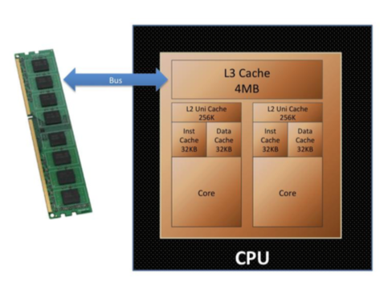

# Lesson 01 
p1 Intro: 

* Accepting AWS 

## L01 p2 Introduction to Big Data: slides [Big Data Introduction 2020](https://virtuale.unibo.it/mod/resource/view.php?id=158213)

Learning goals:
	a) Big Data definition
	b) Big Data applications classification
	c) Big Data applications examples
	d) Big Data and scientific applications

* Bill Gates Dengue and Infectious disease$^{c) d)}$
* Google Traffic – real time…^$^{c) d)}$
* Personalized Medicine$^{c) d)}$

* $^{a)}$Gartner Def: BD is high vol, high-velo high variety that demands cost-effective, innovative forms of information processing that enable enhanced insight, decision making and process automation.
	Scalability (!)

* $^{a)}$The 5 V’s:
	1. Volume: TB - ZB
	2. Velocity &rarr; real time short time to react NOT batch processing
	3. Variety &rarr; mostly semi/unstructured data e.g. XML
	4. Veracity &rarr; accurate, precise and trusted?
	5. Value
		* $^{b)}$Descriptive Analysis
			* Past?
		* $^{b)}$Predictive Analysis
			* Future? &rarr; churn
* $^{b)}$Prescriptive Analysis
	* Future + what to do &rarr; maintenance, customers who have…

* $^{a)}$Hype cycle Gideon Gartner Gartner Inc. 

* Data sources: Time and location data

### $^{c)}$Applications:
* Fast and actionable insight &rarr; visiting web page next page has the ad fit to you
* Sentiment analysis :- /
* Operational Analytics &rarr; filght rerouting &rarr; passengers rerouted to new gates
* Personalized medicine

Have similar amounts of data as FB and google:

* High Energy Physics
* Weather forecasting  

* Four Domains of BD:
	* Acquisition
	* Storage
	* Analytics
	* Distribution

# L02 p1 [The Computational Challenge slides](https://virtuale.unibo.it/mod/resource/view.php?id=158216)
* Checksums
* Move ONLY compressed files: in our example: 90 MB file unzipped is 3 GB
Exercise starts at p1 1:04 [pastebin is here](https://pastebin.com/FRpXcNbE)

# L02 p2 min 29:04 [From the PC to the Datacenter P1](From your laptop to the datacenter PART 1)
* PC components
* 1 byte (B) = 8 bit (b)
* CPU Central Processing Unit aka main processor
      * Electronic circuitry &rarr;  executes instructions that make up a computer program
      * Performs basic arithmeti, logic, controlling, and input/output (I/O) operations specified by the program
    * Principal components of CPU:
        * Arithmetic Logic Unit, ALU
    * Processor registers
        * Supply operands to the ALU and store the results of ALU operations
    * Control unit
        * Orchestrates the fetching from memory and execution of instructions by directing the coordinated operations of the ALU, registers and other components

### Multi-core Processors
* Integrated circuit with two or more **separate** processing units, called cores
    * Earch core reads and executes program instructions, as if the computer had several processors

* Instructions are ordinary CPU instructions such as add, mv and branch data, but the single processor can run instructions of separate cores at the same time 
    * Increases overall speed fo programs that support multi threading or other parallel computing techniques
* CPU is plugged into the socked and can have several processors
### Hyper-threading (intel) thechnology
    * Does NOT miltyply the core/porcessors
    * Virtual / logical cores are doubled, allowing concurrent scheduling
        * System 'sees' multiple cores
    * Increases number of independend instructions performed
    * Multiple instructions operate on separated data in parallel
    * Intel: first hyper-threading implementation used 5\% more die area but performance increased by 15-30\%
        * But performance improvement **depends** on the **application**
            * Can also lead to **less performance** i.e. chashe trash
        * Need more careful allocation of processes

`top`

* Info about 
    * Staus of every single core (logical or physical)
    * Memory
    * Processes

 `top` then `1` shows you the entire list of cpus status of each running different applications

* First col: shows how much CPU is consumed by user processes

* WA colum tells us how much time passes in one IO operation

* `load average:` how many processes are waiting to enter the processor pipeline 
    * Shoul be in same ball park as number of available CPUs
    * If the number is much higher than cores it means the machiene is **overloaded** 
    * Percentage and time used by each processs

* System topology
    * Apps allow you to look at it 
        * 'P' are the physical cores
        * 'L' are the memory lines available in the socket

* `cat /proc/cpuinfo` provides info about every single core seen in the OS
    * Number
    * Frequency
* `flags:` show all functionalities or capabilities supported by the processor
 * Vector instructions such as `avx` from intel...
 
  `top` 

* To look at the disks and FS
    `free -m`

* To check memory:

### System Memory

* 'Memory' will be used for RAM
* Random-access memory stores info for immediated use
    * Can be read and changed in any order = random
    * Used to store working data and machine code before being transferred to the CPU
    * Associated with volatile types of memory
    * Many computer systems havea **memory hierarchy** consisting of 
        * Processor registers
        * On-die SRAM
        * Chaches
        * External chaches
        * DRAM
        * Paging systems
        * Virtual memory or swap space on a hard drive

* Cache is organized in different levels (L):
    * Core &rarr; L1 cache &rarr; L2 cache &rarr; L3 cache &rarr; Bus connects processor to main memory
* Main system RAM is on top of the chache hierarchy  

|Level| Access latency in clock cycles| nano seconds in 2012 |
|:---:|:---:|:---:|
| L1 | 4 cc|  0.5 |
| L2| 11 cc | 7 |
|L3 | 39 cc| - |
|Main| 107 cc| - |

* CPU clock is in order of Giga Herz &rarr; cycles in the order of aproximately nano seconds
* Disk seek is in the order of milli second (10, 000, 000 ns) &rarr; ten million times slower than accessing L1 cache
* Thats why RAM and cache are so important

### Memory Bandwith
* Rate at wich data can be read from or stored to a semiconductor memory by a processor
    * Expressed in bytes/second

* Total bandwith is the **product of**
    * Base clock frequency
    * Number of data transfers per clock: 2 in case of 'double data rate (DDR, DDR2, DDR3, DDR4)'
    * Number of interfaces: Modern personal computers usually use 2 memory interface = dual channel mode for an effective 128-bit bus width

* RAM is on top of the hierarchy but its not completely true;
* Modern systems extend RAM capacity using "virtual memory" = **swap memory** 
    * Move some of the info stored in the RAM is moved into the disk as 'paging file' or 'scratch partition'
    * This can lead to **thrashing** and lower the performance of the system
    * &rarr; HD = a lot slower than RAM

**RAM Disk** is the contrary: 

* Portion of the computers' RAM, acting as a much faster HD
    * RAM disk looses stored data on shut down, unless you use some standby battery source (slide 19 stopped)
# L02 p2 continued exercise
   

# L03 p1

Single components:
1.	CPU
2.	Memory
3.	Networking  and Network Protocols
4.	Mass storage devices

CPU Farm in a Datacenter
i. Batch system, queues, allocation policies, quota etc..
Storage systems in a Datacenter
I. DAS vs NAS
II.   SAN
III.   TAN
IV.   Parallel FS
V.   Data lifecycle, QoS
- Migration, recall, ACL
Monitoring and Provisioning
Hands on: Submission on a small cluster already available to students
